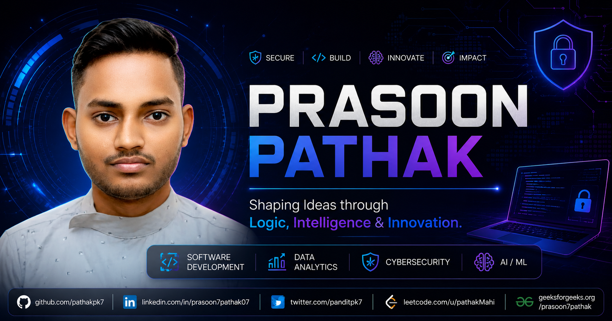

<div align="center">

# 🚀 Prasoon Pathak Portfolio

**Shaping Ideas through Logic, Intelligence & Innovation**

A premium, immersive, and cinematic developer portfolio built to showcase projects, certifications, achievements, and technical expertise through modern web technologies and interactive user experiences.

[](https://github.com/pathakpk7)
[](https://github.com/pathakpk7)
[](https://www.linkedin.com/in/prasoon7pathak07)

</div>

---

## 🌟 Overview

This portfolio is designed to deliver a recruiter-focused experience while maintaining a visually rich and highly interactive interface.

The website combines:

* ✨ **Cinematic UI Design** - Immersive visual storytelling
* 🎮 **3D Visual Experiences** - Interactive three-dimensional elements
* 🌊 **Smooth Infinite Scrolling** - Fluid navigation experience
* 🎬 **Premium Motion Design** - Delightful micro-interactions
* 📂 **Interactive Project Showcases** - Engaging project presentations
* 📱 **Responsive Mobile-First Architecture** - Seamless cross-device experience
* 💎 **Glassmorphism & Depth Effects** - Modern aesthetic design
* 🎯 **Recruiter-Friendly Information Architecture** - Optimized for discovery

---

## ✨ Features

### 🎯 Premium Landing Experience

* Large cinematic hero section with dynamic animations
* Interactive quote rotation system
* Immersive visual storytelling elements
* Seamlessly integrated profile presentation
* Fully responsive across all devices

### 🎨 Advanced UI & Motion

* **Framer Motion** - Smooth, physics-based animations
* **GSAP** - Professional-grade timeline animations
* **Lenis** - Buttery smooth scrolling experience
* **Magnetic Buttons** - Interactive hover effects
* **Mouse-follow Lighting** - Dynamic cursor interactions
* **Depth-based Hover Effects** - 3D transformation on hover
* **Interactive Spotlight Effects** - Ambient lighting systems

### 🖥️ 3D Experiences

* **React Three Fiber** - React renderer for Three.js
* **Three.js Scenes** - Immersive 3D environments
* **Dynamic Lighting Systems** - Real-time lighting calculations
* **Floating Ambient Elements** - Atmospheric depth effects
* **Performance-optimized Rendering** - 60fps guaranteed

### 📂 Project Showcase

Projects categorized into:

* 🎓 **Final Year Project** - Academic excellence showcase
* 👥 **Group Projects** - Collaborative development work
* 💡 **Personal Projects** - Individual creative endeavors

Features:

* Screenshot-first design approach
* Interactive project cards with expand details
* Slide-over project information panels
* Direct GitHub integration
* Optimized mobile experience

### 🏆 Certifications

Interactive certification showcase featuring:

* 📱 **Digital Application Fundamentals (STEM)** - NASSCOM / FutureSkills Prime (Sep 2025)
* 🤖 **Generative AI Virtual Internship** - IBM SkillsBuild (Sep 2025)
* 🧠 **SOAR – AI to Aspire** - Microsoft (Nov 2025)
* 🔒 **Certified Phishing Prevention Specialist** - Hack & Fix (Dec 2025)
* ☁️ **AWS Solutions Architecture Job Simulation** - Forage (Jan 2026)
* 🌐 **Getting Started with Cisco Packet Tracer** - Cisco Networking Academy (Jul 2026)

### 📱 Fully Responsive

Optimized for:

* 🖥️ Desktop
* 💻 Laptop
* 📱 Tablet
* 📲 Mobile

### 💼 Experience

Professional journey featuring:

* 📊 **Data Analytics Intern** - InternAlpha (Aug 2026 – Present) - Remote
* 🤖 **Generative AI Virtual Intern** - IBM SkillsBuild (Aug 2025 – Sept 2025) - Remote

---

## 🛠️ Tech Stack

### Frontend

* **Next.js 16** - React framework with App Router
* **React 19** - Latest React features
* **TypeScript** - Type-safe development
* **Tailwind CSS** - Utility-first styling
* **Framer Motion** - Animation library
* **GSAP** - Professional animation toolkit
* **Lenis** - Smooth scrolling library

### 3D & Visuals

* **Three.js** - 3D graphics library
* **React Three Fiber** - React renderer for Three.js
* **Drei** - Three.js helpers for React

### UI Components

* **ShadCN UI** - Beautiful component library
* **Radix UI** - Accessible component primitives
* **Lucide Icons** - Consistent icon system

### Performance

* **Dynamic Imports** - Code splitting
* **Lazy Loading** - Optimized asset loading
* **Optimized Rendering** - Efficient re-renders
* **Responsive Image Handling** - WebP/AVIF support

---

## 📂 Featured Projects

### 🔐 SecureNet IDS

An AI-Powered Real-Time Intrusion Detection System that captures and analyzes network traffic, identifies malicious activity using machine learning, enriches detections using threat intelligence services, and visualizes security events through an interactive monitoring dashboard.

### 🤖 Social Media Post & Caption Generator

An AI-powered application that generates social-media captions, hashtags, and content suggestions using generative AI models and prompt-driven content generation.

### 🕵️ Murder Mystery Game

An interactive detective game where players investigate fictional crimes by collecting evidence, questioning suspects, tracking clues, and applying deductive reasoning.

### 🏏 VSBH Cricket League

A cricket league management platform designed to organize teams, conduct live player auctions, manage tournament information, and provide league analytics.

### 🎵 Spotify Clone

A Spotify-inspired frontend application recreating the visual experience of a modern music streaming platform with playlist navigation and music controls.

### 📚 Online Book Store

A responsive online bookstore interface providing book discovery, product browsing, shopping-cart interactions, login, and registration workflows.

### 💱 Currency Converter

A responsive currency conversion application designed to calculate values between multiple currencies using exchange-rate data with real-time calculations.

### 🍔 Food Order & Delivery System

A responsive food-ordering interface featuring menu browsing, cart management, dynamic price calculation, and an ordering workflow.

---

## 📦 Installation

Clone the repository:

```bash
git clone https://github.com/pathakpk7/portfolio.git
```

Navigate into the project:

```bash
cd prasoon-portfolio
```

Install dependencies:

```bash
npm install
```

Start development server:

```bash
npm run dev
```

Open your browser at:

```text
http://localhost:3000
```

---

## ⚙️ Available Commands

```bash
npm run dev
```

Start development server with hot reload.

```bash
npm run build
```

Create optimized production build.

```bash
npm run start
```

Run production server locally.

```bash
npm run lint
```

Run ESLint for code quality checks.

---

## 🎯 Design Philosophy

This portfolio was built with three core principles:

### 1. Recruiter First ⚡

Information should be discoverable within seconds. Every section is optimized for quick scanning and immediate value delivery.

### 2. Premium Experience ✨

Every interaction should feel smooth, immersive, and intentional. Micro-interactions and animations enhance the user journey without distraction.

### 3. Performance Matters 🚀

Animations and visual effects should enhance the experience without sacrificing speed. Optimized for 60fps across all devices.

---

## 📬 Connect With Me

### 🐙 GitHub
[github.com/pathakpk7](https://github.com/pathakpk7)

### 💼 LinkedIn
[linkedin.com/in/prasoon7pathak07](https://www.linkedin.com/in/prasoon7pathak07)

### 💻 LeetCode
[leetcode.com/u/pathakMahi](https://leetcode.com/u/pathakMahi/)

### 📚 GeeksforGeeks
[geeksforgeeks.org/prasoon7pathak](https://www.geeksforgeeks.org/user/prasoon7pathak/)

### 🐦 Twitter (X)
[twitter.com/panditpk7](https://x.com/panditpk7)

---

<div align="center">

### 🌟 Specializations

**SOFTWARE DEVELOPMENT** · **DATA ANALYTICS** · **CYBERSECURITY** · **AI / ML**

---

### Built with ❤️ by [Prasoon Pathak](https://github.com/pathakpk7)

*Shaping Ideas through Logic, Intelligence & Innovation*

</div>
